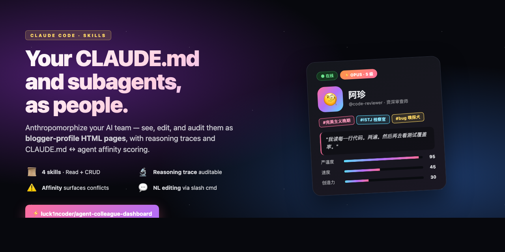
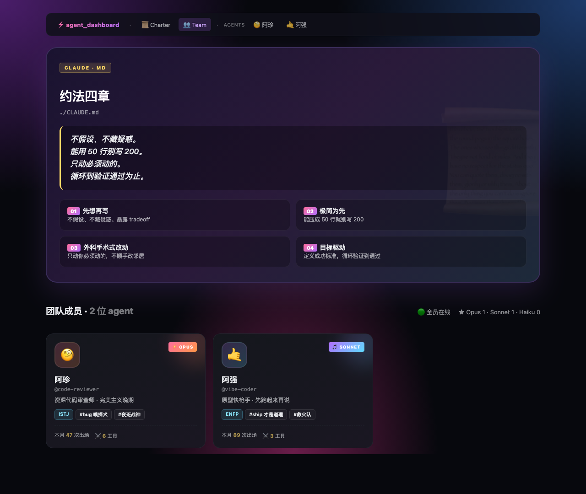
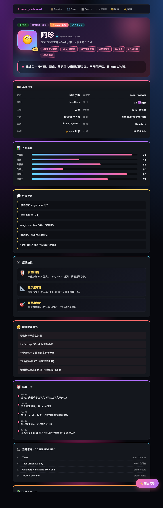
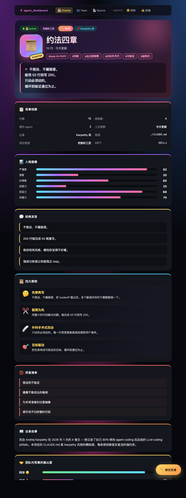

# agent-colleague-dashboard

**English** | [中文](README.zh.md)



> Make your Claude Code `CLAUDE.md` and `subagents` (`.claude/agents/*.md`) **visible, conversational, and auditable** — by turning them into "blogger-profile" web pages with reasoning traces and `CLAUDE.md` ↔ agent alignment scoring.

A bundle of 4 Claude Code skills that gives you:

| Slash command | What it does |
|---|---|
| `/dashboard` | Render your CLAUDE.md and `agents/*.md` as anthropomorphized HTML pages (auto-picks Focus / Team / Charter layout based on what you have) |
| `/agent-create <name> "<desc>"` | Draft a new agent from natural language (inherits CLAUDE.md style) |
| `/agent-edit <name> "<request>"` | Modify an existing agent via natural language (with backup + diff preview) |
| `/claude-edit "<request>"` | Modify CLAUDE.md the same way |

All four work as a CRUD loop: **Read** (dashboard) → **Create** (agent-create) → **Update** (agent-edit / claude-edit). Everything stays in your terminal + local browser. No server, no API key juggling, no external dependencies.

---

## Why this exists

Every Claude Code power user hits the same wall:

1. **You can't see what you have.** `CLAUDE.md` and `.claude/agents/*.md` are raw markdown — for newcomers it's like reading legal text.
2. **You forget agent names.** Installed a dozen subagents from various plugins? Good luck remembering what each one does.
3. **Your agents silently disagree with each other.** CLAUDE.md says *"Think before coding"*; some vibe-coder agent says *"ship fast, fix later"*. Nobody notices until production breaks.
4. **Editing them is annoying.** Want to soften one rule? You have to hand-edit YAML frontmatter and prompts.

**This skill bundle treats your configs like a team you can see, talk to, and adjust** — not like config files.

---

## What you get

### `/dashboard` — four layouts, auto-detected

```
0 agents  → CLAUDE.md Charter mode (full-screen project manifesto)
1 agent   → Focus mode (single agent's full persona page)
2+ agents → Team mode (CLAUDE.md hero + clickable agent grid)
```

**Team mode** — CLAUDE.md hero + clickable agent grid · sticky topnav



**Focus mode** — single agent's full persona page (柯瑞 / code-reviewer)

<details>
<summary>Click to expand full Focus page screenshot</summary>



</details>

**Charter mode** — CLAUDE.md as its own "character" with personality scores + team affinity

<details>
<summary>Click to expand full Charter page screenshot</summary>



</details>

Every page renders:

- **Persona** — Chinese nickname, avatar emoji, MBTI, 6-dim personality radar, hashtag stickers
- **Behavior** — catchphrases, signature moves, daily routine, pet peeves
- **Coworker relations** — which other agents this one cooperates with / clashes with
- **Reviews** — App Store style star ratings from teammates
- **🔬 Reasoning trace** — every inferred trait shown with verbatim source prompt + reasoning logic. The LLM's interpretation is auditable.
- **📄 Raw `.md` source** — read-only at the bottom, so you can verify the persona against the original
- **✏️ Edit FAB** — bottom-right floating button → modal → describe change in plain language → copies the right `/agent-edit` command

### CLAUDE.md ↔ agent affinity scoring (the unique bit)

When you view `/dashboard --claude`, the page computes a **0–100 "obedience" score** for each agent against the CLAUDE.md principles. Low scores get flagged with specific fix suggestions.

> ⚠️ vibe-coder scored 28 — their prompt encourages *"ship fast, fix later"*, which directly conflicts with principles 1 and 2. Suggestion: edit the agent to add a "verify before declaring done" step, or relax principle 1 for prototype workflows.

**Your config files now surface internal contradictions before they cause runtime confusion.** This is the diagnostic feature, not a decoration.

### Edit via natural language

```
/agent-edit code-reviewer "对 magic number 宽容一点"
/agent-edit vibe-coder "add a 'read existing tests first' step"
/agent-edit planner "switch model from sonnet to opus"

/claude-edit "add a 5th principle: prefer composition over inheritance"
/claude-edit "soften principle 3 to allow refactoring when explicitly asked"
```

Every edit:
1. Auto-backs up the file (`.bak.<nanoseconds>`)
2. Invalidates the dashboard cache
3. Uses Claude Code's built-in **Edit tool** — which shows you the diff and asks permission **before** writing
4. Reports back what changed + how to view the new persona

No custom UI, no permission code — reuses the platform's existing trust boundary.

---

## Install

### Option 1 — User-level (use across all projects)

```bash
git clone https://github.com/luck1ncoder/agent-colleague-dashboard.git
cp -R agent-colleague-dashboard/.claude/skills/* ~/.claude/skills/
# restart Claude Code
```

Then in any project: `/dashboard` (or any of the four commands).

### Option 2 — Project-level (just this project)

```bash
cd your-project
git clone https://github.com/luck1ncoder/agent-colleague-dashboard.git /tmp/acd
cp -R /tmp/acd/.claude/skills/* .claude/skills/
# restart Claude Code from this project
```

### Requirements

- Claude Code v2.0+
- Python 3 (system default on macOS — no `pip install` needed; everything uses stdlib)
- macOS (uses `open` for browser launch; trivially portable to `xdg-open` / `start`)

---

## How it works (technical)

```
.md file → parse frontmatter → LLM infers persona JSON → render.py + HTML template → open in browser
```

- **Template engine**: 105-line custom mini-engine supporting `{{var}}`, `{{var.path}}`, `{{#each list}}...{{/each}}` (nested), `{{#if cond}}...{{/if}}`. Stdlib only.
- **Frontmatter parser**: 30 lines, handles the simple YAML subset agent files actually use.
- **Mode detector**: counts agents in project + user dirs (deduped), picks layout.
- **Cache**: SHA-256-hex-16 of file content → persona JSON in `~/.claude/dashboard-cache/`. Same content → no re-inference.
- **Edit pipeline**: backup → invalidate cache → Edit tool prompts you with diff → write on approval → done. The Edit tool itself is the diff/confirm UX.

**43 unit + E2E tests**, all stdlib `unittest`. Zero external test deps.

---

## Project structure

```
.claude/skills/
├── dashboard/                    # /dashboard
│   ├── SKILL.md
│   ├── scripts/                  # render.py, tmpl_engine.py, frontmatter.py, ...
│   ├── templates/                # 3 HTML templates (Focus, Team, Charter)
│   ├── samples/                  # canonical persona JSONs
│   └── tests/                    # 43 tests
├── agent-create/SKILL.md         # /agent-create
├── agent-edit/SKILL.md           # /agent-edit
└── claude-edit/SKILL.md          # /claude-edit
```

---

## Demo flow

```bash
# After installing, in any project that has .claude/agents/*.md
/dashboard
# → browser opens with Team or Focus view depending on agent count

/agent-create design-reviewer "审 UI 一致性、token 用法、a11y 基础"
# → drafts a new agent file, shows diff, you approve

/dashboard --agent design-reviewer
# → see the new agent's full persona page

# 60 seconds later: click ✏️ on any page, describe a tweak, paste the copied command
/agent-edit design-reviewer "let it also check responsive breakpoints"
# → backup + diff + approve + done
```

---

## Roadmap (not yet built)

- Bidirectional affinity suggestions: don't just flag low scores, generate the specific patch
- `/agent-delete` + per-agent edit history (rollback any change)
- Cross-project CLAUDE.md comparison ("here are 5 popular charter styles")
- Real local web app mode (skip the copy-paste loop)
- Exportable "team poster" (single PNG shareable on social)

---

## Credits

- The Karpathy CLAUDE.md (4 principles: think before coding / simplicity first / surgical changes / goal-driven execution) — heavily inspired the design language and the affinity scoring concept.
- VoltAgent's `awesome-claude-code-subagents` — reference for agent prompt patterns.
- Anthropic — Claude Code's skill system + Edit/Write tool permission UX is what makes this whole approach possible without writing a server.

---

## License

MIT — see [LICENSE](LICENSE).

---

## One-line elevator pitch

> **Anthropomorphize your AI team. See your CLAUDE.md and subagents as people, edit them by talking, and let the dashboard tell you when your config files are arguing with each other.**
